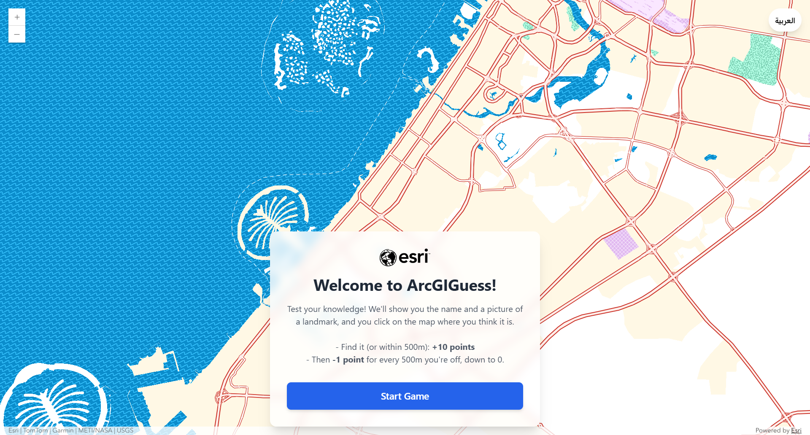

# ArcGIGuess

**ArcGIGuess** is a browser-based "guess where it is" geography game built with the
[ArcGIS Maps SDK for JavaScript](https://developers.arcgis.com/javascript/). It's a
small, dependency-light showcase of how a web map plus a hidden feature layer can
be turned into a fun, competitive experience — think GeoGuessr, but for *your* set
of landmarks.

Players are shown the **name and a photo** of a landmark and must **click the map**
where they think it is. The closer the guess, the more points they earn. It ships
with an optional multilingual UI, a shareable results card, and an optional
Survey123-powered leaderboard.



---

## How it works

1. The app loads an ArcGIS **web map** you specify (the basemap the player sees).
2. Inside that web map, a **landmark layer** (polygons) is hidden — its features
   are the "answers". Each feature has a name (in one or more languages) and a
   photo attached as an attachment.
3. Each round shows a landmark's name + photo. The player clicks the map to guess.
4. Scoring is distance-based:
   - A guess **inside the landmark polygon (or within one distance band of it)**
     earns full points.
   - Beyond that, points drop by a fixed amount for every distance band the guess
     is off, down to a configurable minimum.
5. At the end, players see their **total score** and **accuracy**, and can share a
   results image or (optionally) submit their score to a leaderboard.

---

## Quick start

No build step, no framework, no npm install — it's plain HTML/CSS/JS that loads the
ArcGIS SDK and Tailwind from a CDN.

1. **Clone** this repository.
2. **Serve the folder** with any static web server (opening `index.html` directly
   won't work because the browser blocks some requests from `file://`):
   ```bash
   # Python
   python -m http.server 8000

   # or Node
   npx serve
   ```
3. Open the served URL (e.g. `http://localhost:8000`) in your browser.

Out of the box it points at a demo web map, so you'll see it run immediately. To
make it your own, edit **[`config.js`](./config.js)** — that's the only file you
need to touch.

---

## Making it your own

Everything configurable lives in **[`config.js`](./config.js)** as
`window.ARCGIGUESS_CONFIG`. Each option is documented inline. The essentials:

### 1. Point it at your data

| Setting | What it is |
| --- | --- |
| `portalUrl` | The portal hosting your web map. `null` uses ArcGIS Online; set it to your **ArcGIS Enterprise** portal URL (e.g. `https://gis.example.com/portal`) to use Enterprise. |
| `webMapItemId` | The item ID of your ArcGIS **web map** (the basemap players see). |
| `landmarkLayerTitle` | The **title of the layer** inside that web map holding your landmarks. It's hidden during play. |
| `landmarkIdField` | The unique ID field on that layer (used to fetch each landmark's photo attachment). |
| `roundsPerGame` | How many landmarks to play per game (`null` = all of them). |
| `shuffleLandmarks` | `true` randomizes the order each game. `false` plays them in the layer's natural order. |
| `allowFinishEarly` | `true` shows a "Finish early" button so players can accept their score and jump to the results (remaining landmarks count as missed). |

> **ArcGIS Enterprise:** by default ArcGIGuess talks to ArcGIS Online. To point it
> at an Enterprise portal instead, set `portalUrl` to your portal's URL — the web
> map, its layers, and any sign-in prompts will all target that portal.

> **Guided tour mode:** set `shuffleLandmarks: false` to walk players through your
> landmarks in a fixed, deliberate sequence — great for a curated tour, an
> onboarding walkthrough, or a story with a beginning, middle, and end. Combine it
> with `roundsPerGame` to always feature the same first _N_ landmarks.

> **Private data?** If your web map or layer isn't public, the ArcGIS SDK will
> automatically prompt the player to sign in when the app loads. You don't need to
> configure OAuth in this project — just make sure the signed-in user has access.

Your landmark layer should contain **polygon** features, each with:
- a **name field** for every language you support (see below), and
- an **image attachment** (the first attachment is used as the photo).

### 2. Brand it

| Setting | What it is |
| --- | --- |
| `appName` | Your game's name (browser tab, share card, share text). |
| `tagline` | Short subtitle used in the page title and share-card footer. |
| `shareCardFooter` | Footer text on the shareable results card (`null` = use `tagline`). |

**Images are just files** — replace them in [`assets/`](./assets), keeping the
same filenames (no config needed):

- `logo.svg` — shown on the start screen and the results card.
- `pin.svg` — the guess marker, which drops with a little bounce. Keep the
  pointed **tip at the bottom-center**; if you change its proportions, update
  `PIN_WIDTH` / `PIN_HEIGHT` in [`script.js`](./script.js).
- `screenshot.png` — used in this README and as the social link-preview image.

### 3. Tune the scoring

The `scoring` block is the single source of truth — the on-screen rules
explanation is generated from these numbers, so it can never fall out of sync:

```js
scoring: {
    pointsForHit: 10,     // points for a perfect / very close guess
    bucketMeters: 500,    // size of each distance band, in meters
    penaltyPerBucket: 1,  // points lost per band you're off
    minScore: 0,          // lowest a single round can score
}
```

### 4. Set the language(s)

`languages` is an array — the **first entry is the default**, and a toggle button
switches between them. To go **English-only**, delete the second entry. To use a
**different second language**, replace the Arabic entry with your own. Each language
defines its text direction, the landmark name field to read, and every on-screen
string. Placeholders in `{curly braces}` are filled in by the app.

### 5. (Optional) Leaderboard

Set `leaderboard.enabled` to `false` to hide the Submit/Leaderboard buttons and run
the game with no backend at all. To enable it you need:

- A **Survey123** form that collects a name and a score (`survey123Url`,
  `submitScoreFieldId`).
- A public/shared **FeatureServer view** of that form's results to read scores from
  (`dataApiUrl` plus the `firstNameField` / `lastNameField` / `scoreField`).

### 6. Social sharing / link previews

When someone shares your game's **link** on WhatsApp, LinkedIn, Facebook, X, Slack,
etc., those platforms show a preview card (title, description, image). Configure it
in the `social` block: `title`, `description`, `image`, `url`, and `twitterHandle`.

- Provide a preview image (recommended **~1200×630px**) and reference it in
  `social.image`. Use an **absolute URL** for the most reliable results — this repo
  reuses `assets/screenshot.png`.
- **Important:** link-preview crawlers do **not** run JavaScript. ArcGIGuess mirrors
  your `social` values into the page's `<meta>` tags at runtime (helpful for in-app
  sharing and JS-aware tools), but for **guaranteed** previews you should also paste
  the same values into the matching `<meta>` tags in the `<head>` of
  [`index.html`](./index.html). They're clearly commented there.
- Test your previews with the
  [Facebook Sharing Debugger](https://developers.facebook.com/tools/debug/) or
  [LinkedIn Post Inspector](https://www.linkedin.com/post-inspector/).

When players share their **score**, ArcGIGuess generates a branded results image
(score, accuracy, landmarks found, your logo) on the fly and shares it via the
native share sheet where supported, or offers it for download otherwise.

---

## Project structure

```
index.html    Page markup, panels, and modals. Loads the ArcGIS SDK, Tailwind, config.js, script.js.
config.js     ← EDIT THIS. All settings: map, layer, scoring, languages, branding, leaderboard.
script.js     Game logic. Reads config.js; you rarely need to touch it.
style.css     Layout, button styles, RTL support, mobile tweaks.
assets/       Your logo and any other static images.
```

## Tech notes

- **No build step.** The [ArcGIS Maps SDK for JavaScript](https://developers.arcgis.com/javascript/)
  **5.1**, Tailwind CSS, and html2canvas are all loaded from CDNs in `index.html`.
- **Modern SDK usage.** The map is rendered with the `<arcgis-map>` **web
  component**, core modules are loaded on demand via `$arcgis.import()`, and
  spatial checks use the current **geometry operators** (`containsOperator`,
  `distanceOperator`) — no legacy AMD `require` or manual `MapView`.
- **Sharing** uses the [Web Share API](https://developer.mozilla.org/docs/Web/API/Web_Share_API)
  where available, with a downloadable-image fallback.
- **Testing shortcut:** open the browser console and run `skipToResults()` to jump
  straight to the results screen with a random score.

## License

Released under the [MIT License](./LICENSE) — free to use, modify, and share.
Landmark data, imagery, and logos you supply are your own; this project is just
the game shell around them.
